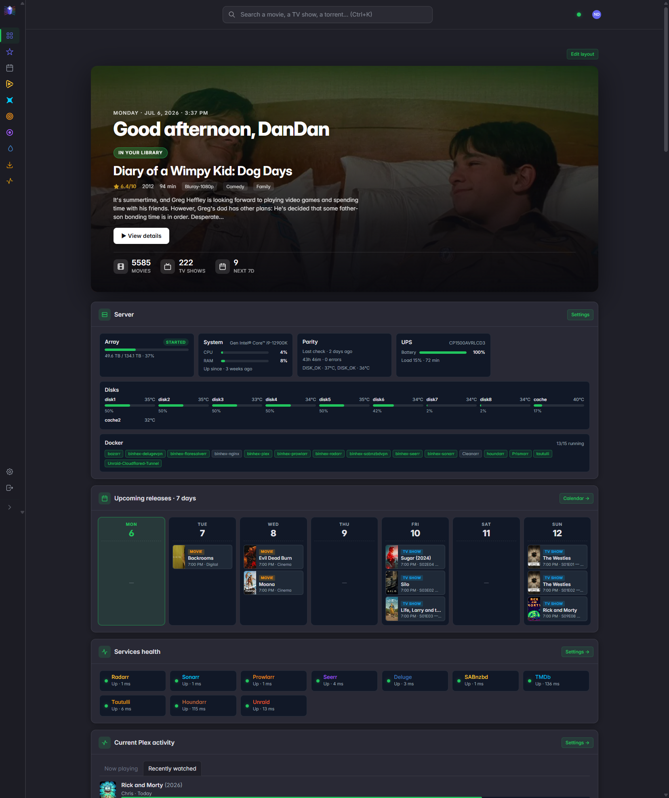
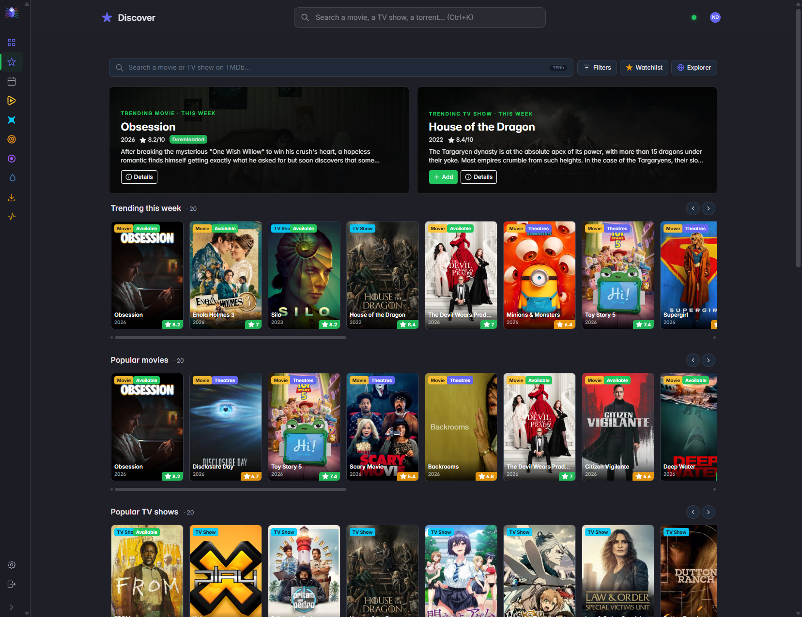
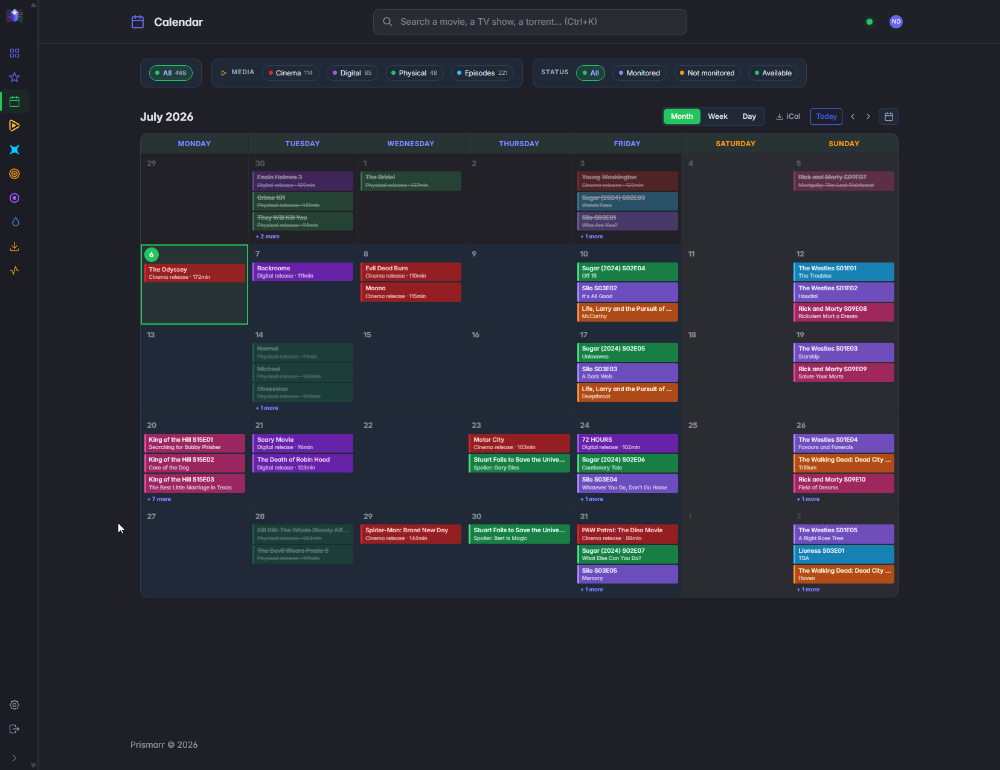
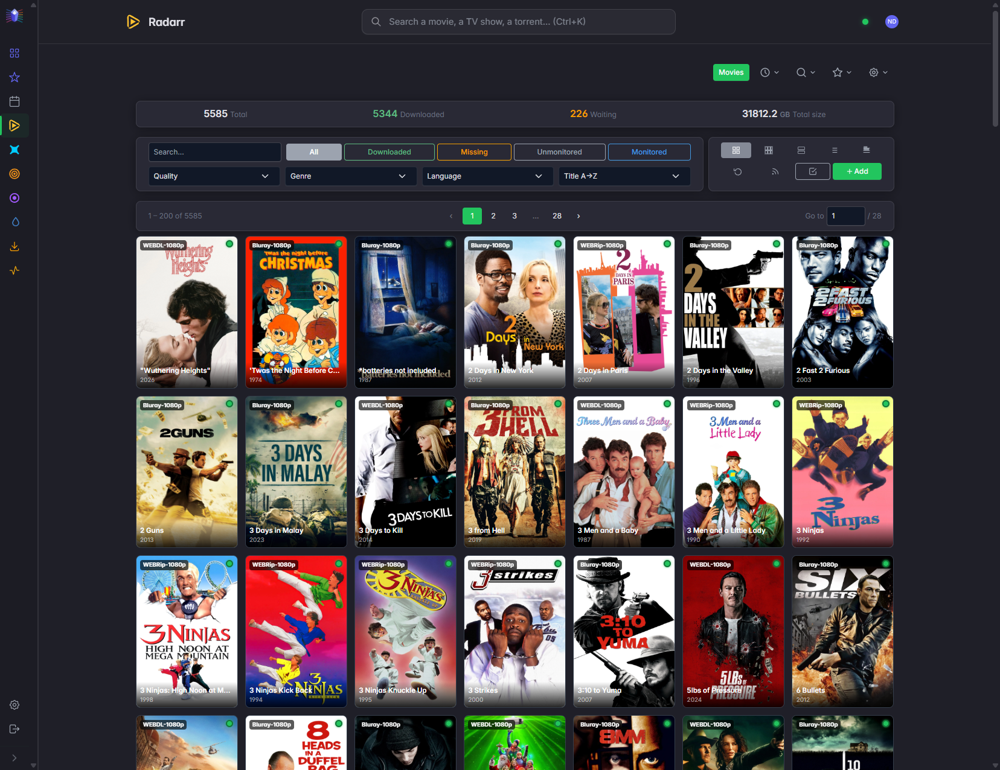
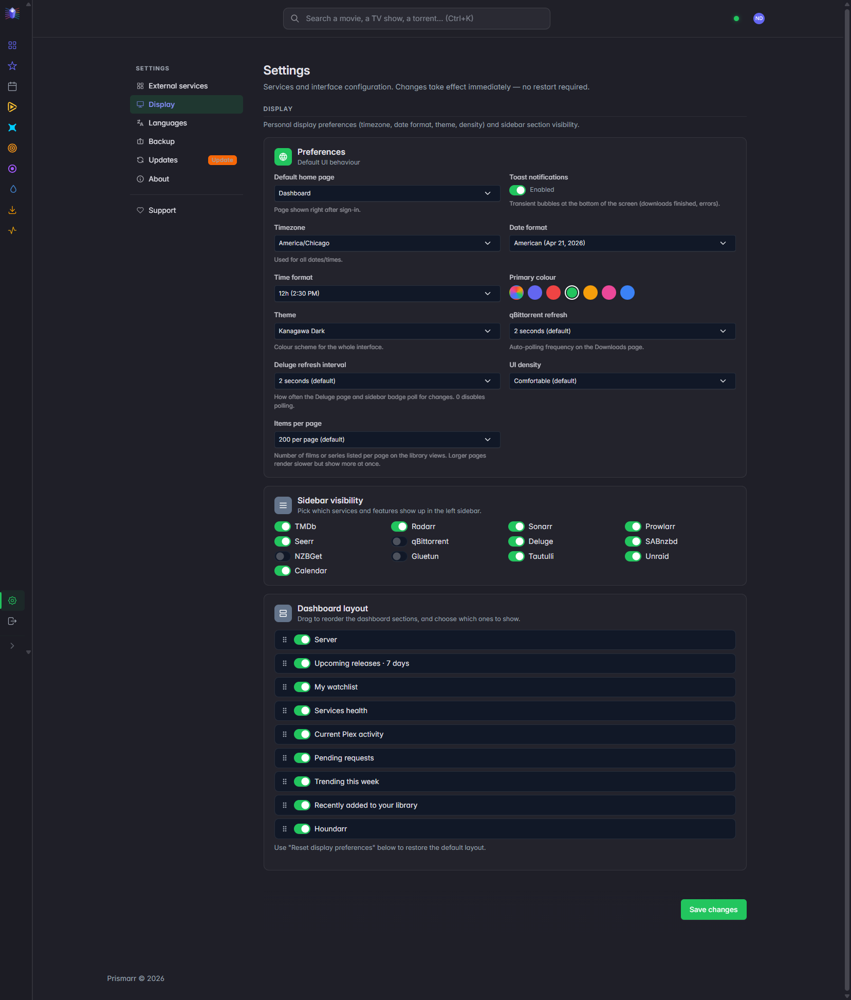

<p align="center">
  
</p>

<p align="center">
  <strong>One dashboard for your self-hosted media stack.</strong>
</p>

<p align="center">
  <a href="https://github.com/Shoshuo/Prismarr/releases"></a>
  <a href="https://github.com/Shoshuo/Prismarr/actions/workflows/ci.yml"></a>
  <a href="https://hub.docker.com/r/shoshuo/prismarr"></a>
  <a href="https://hub.docker.com/r/shoshuo/prismarr"></a>
  <a href="https://github.com/Shoshuo/Prismarr"></a>
  <a href="https://github.com/Shoshuo/Prismarr/commits/main"></a>
  <a href="https://discord.gg/wd4hwU3jTF"></a>
  <a href="https://buymeacoffee.com/shoshuo"></a>
</p>

<p align="center">
  <a href="https://github.com/Shoshuo/Prismarr/blob/main/LICENSE"></a>
  
  
  
  
</p>

<p align="center">
  <a href="#features">Features</a> ·
  <a href="#quick-start">Quick start</a> ·
  <a href="#configuration">Configuration</a> ·
  <a href="#upgrade">Upgrade</a> ·
  <a href="#troubleshooting">Troubleshooting</a> ·
  <a href="#whats-next">What's next</a> ·
  <a href="#support-and-community">Support</a> ·
  <a href="#license">License</a> ·
  <a href="#note-on-ai-usage">AI</a>
</p>

---

<p align="center">
  
</p>

<details>
<summary><strong>Static screenshots</strong> (click to expand)</summary>
<br>

<p align="center">
  
  
</p>
<p align="center">
  
  
</p>
<p align="center">
  
  
</p>
<p align="center">
  
</p>

</details>

---

## About

**Prismarr** brings qBittorrent, Radarr, Sonarr, Prowlarr, Seerr and
TMDb together in a single modern Symfony interface. No more juggling six
tabs to manage your library.

It's not a replacement for Radarr or Sonarr - those run side by side and
keep doing what they do best. Prismarr is the unified control surface:
one search bar that hits the local library and TMDb, one calendar that
merges movie releases and episode airs, one dashboard that surfaces what
matters today (a recent download, a pending request, a trending pick),
and one settings page where every API key lives - never on disk in plain
text and never in environment variables.

The whole thing ships as a single Docker container with SQLite inside.
First boot opens a 7-step wizard: create the admin, plug your services in,
done. No external database, no Redis, no per-service `.env` files. Pull
the image, mount one volume, you're up.

---

## Project status

Prismarr is maintained by a single developer (for now) in spare time.
The codebase is production-ready - I run it on my own homelab daily - but
support, bug fixes and new features land when I have the bandwidth. There
is no SLA, no commercial backing and no team behind this.

That said, I actively welcome and encourage feedback. **Feature requests,
bug reports, code reviews, UI critiques, design ideas, translations** - if
you take the time to write something, I'll take the time to read it
carefully and reply. Open an issue, drop a PR, or just tell me what's
missing or what could be better. Outside contributors are exactly how a
solo project becomes a real one, and I'd love that to happen.

The [CHANGELOG](CHANGELOG.md) is kept up to date, and the [public Kanban](https://github.com/users/Shoshuo/projects/4)
shows what's in progress, what's planned for the next release and what's
queued for later.

---

## Why Prismarr?

The selfhosted dashboard space is crowded. Here's where Prismarr fits and
where the others might suit you better:

- **[Organizr](https://organizr.app/)** - HTPC-focused, iframes the
  underlying services into tabs. Excellent if you want each service's
  full UI inside one page; less so if you want a unified library view
  rather than six side-by-side dashboards.
- **[Heimdall](https://heimdall.site/)**, **[Homer](https://github.com/bastienwirtz/homer)**,
  **[Homepage](https://gethomepage.dev/)** - bookmark-style launchers
  with widgets. Lightweight and fast; they don't *understand* your
  library, they just link to other apps.
- **[Homarr](https://homarr.dev/)** - drag-and-drop launcher with rich
  widgets. Closer to Prismarr in spirit but still a launcher: Radarr is
  a tile, not a page.
- **[Seerr](https://docs.seerr.dev/)** (the unified successor of the
  archived Overseerr / Seerr) - request frontend. Prismarr embeds
  Seerr as one component among others; if requests are *all* you need,
  Seerr alone is enough.
- **Servarr web UIs themselves** - the most powerful option. Prismarr
  doesn't replace them; it sits on top and gives you a unified search,
  calendar, dashboard and download view.

**Pick Prismarr if** you want a single Symfony app that *consumes* the
APIs of your existing stack, gives you one search box across the local
library and TMDb, one calendar that merges movie and episode releases,
one dashboard that surfaces what matters today, and one settings page
where every API key lives - all in one Docker container with SQLite, no
external dependencies.

**Pick something else if** you want iframes (Organizr), pure bookmarks
(Heimdall / Homer / Homepage), drag-and-drop dashboards (Homarr) or just
a request UI (Seerr).

---

## Features

### Unified media management
- Movies (Radarr) and Series (Sonarr) with five view modes
- **Multiple Radarr / Sonarr instances side by side** (e.g. Radarr 1080p
  + Radarr 4K + Radarr Anime). Each instance is first-class in the UI:
  per-instance pages, per-instance health badge, per-instance Ctrl+K
  search results. Add, rename, reorder and toggle instances from
  `/admin/settings` without leaving Prismarr
- Global `Ctrl+K` search across every enabled instance + TMDb / TheTVDB
- Quick-add modal with a per-instance target picker — when a film is
  already on Radarr 1080p you can still push it to Radarr 4K from one click
- Unified calendar (movie + episode releases) merged across every
  instance and deduped by `tmdbId` / `tvdbId`, with month / week / day
  views and an iCal export

### Dashboard
- Hero spotlight with a random pick from your library
- Upcoming releases (seven-day mini-calendar)
- Pending Seerr requests enriched with TMDb metadata
- Live health of all configured services
- Personal watchlist, weekly TMDb trending, latest library additions
- **Quick-look in place:** click any tile (hero, upcoming, trending, watchlist,
  latest additions) to open a read-only detail modal right on the dashboard —
  poster, status, rating, genres and synopsis — with a deep-link to manage it in
  Radarr/Sonarr or open it in Discover, instead of navigating away
- Optional **Current Plex activity** widget via the Tautulli API: active
  streams, Direct Play / Direct Stream / Transcode counts, LAN/WAN
  bandwidth and a per-session card (read-only, refreshes every 10s)
- Near-instant load: the page paints first, then each widget hydrates on its own

### Plex activity (Tautulli)
- Dedicated **Plex Activity** page (its own sidebar entry) backed by a
  read-only Tautulli connection — the API key never leaves the server and
  every response is sanitised before it reaches the browser
- Live "Now playing": a stream-summary strip (session count, Direct Play /
  Direct Stream / Transcode breakdown, total / LAN / WAN bandwidth) plus a card
  per session showing quality, an HDR/SDR badge and, when transcoding, the
  source→target codec
- Watch statistics with a 7 / 30 / 90-day toggle: most-watched movies and
  shows, most-active users, top platforms
- Graphs: plays over time with a Media-type ⇄ Stream-type toggle, plays by hour
  of day and by day of week, and a platform × stream-type "problem clients"
  chart
- A dense watch-history grid and a per-library item / episode count
- Every title opens the in-app info modal (synopsis, ratings, cast/crew); each
  section fails open independently, so a down Tautulli never breaks the page

### Downloads
- Full qBittorrent dashboard: server-side pagination, sorting and filters
- Drag-and-drop `.torrent` upload (multi-file)
- Pipeline badges: clicking a torrent jumps to its movie / series
- Cross-tab toasts when a download finishes
- Optional Gluetun integration: public IP, country, port forwarding sync

### Discovery
- TMDb landing page with hero, personalised recommendations, trending
- Personal watchlist, Explorer with filters (genre / decade / cast)
- Countdown for upcoming releases
- Deep-links into your existing library

### Profile and preferences
- `/profil` page: edit display name, password and avatar (JPG / PNG / WebP / GIF, 2 MB max)
- Display preferences: theme colour, UI density, toasts, timezone,
  date / time format, qBit auto-refresh, default home page
- English / French UI (EN-first, FR fully translated, ICU plural support)
- Settings export / import (credentials are always stripped)

### Security
- Symfony authentication with login rate-limiter (5 attempts per IP+username / 15 min)
- Container runs as non-root, dynamic Content-Security-Policy
- SSRF protection on user-provided URLs (protocol allowlist, cloud-metadata blocklist)
- CSRF tokens on every mutation, branded error pages that never leak exception data
- Profiler routes return 403 for non-RFC1918 clients in dev

---

## Quick start

### Requirements

- Docker and Docker Compose
- At least one of: qBittorrent, Radarr, Sonarr, Prowlarr, Seerr
- Optional: Gluetun if qBittorrent runs behind a VPN
- Optional: a TMDb API key (free) to enable the Discovery page
- Optional: a Tautulli instance (URL + API key) for the Current Plex activity widget

### Install

**Step 1.** Get a `docker-compose.yml` file. Pick one of the two options below.

#### Option A — Copy-paste

Create a file named `docker-compose.yml` with the following content:

```yaml
services:
  prismarr:
    image: shoshuo/prismarr:latest
    container_name: prismarr
    restart: unless-stopped
    stop_grace_period: 30s
    ports:
      - "7070:7070"
    volumes:
      - prismarr_data:/var/www/html/var/data

volumes:
  prismarr_data:
```

#### Option B — Download

```bash
wget -O docker-compose.yml https://raw.githubusercontent.com/Shoshuo/Prismarr/main/docker-compose.example.yml
```

(or `curl -O https://raw.githubusercontent.com/Shoshuo/Prismarr/main/docker-compose.example.yml && mv docker-compose.example.yml docker-compose.yml`)

#### Option C: Bind-mount (Servarr-style layout)

If you prefer host folders next to your other Servarr containers (Radarr, Sonarr, etc.) for easy browsing, replace the named volume with a bind-mount. The container target must stay at `/var/www/html/var/data`:

```yaml
    volumes:
      - ./prismarr-config:/var/www/html/var/data
```

Drop the top-level `volumes:` block from Option A, and create the host folder before first start: `mkdir -p ./prismarr-config`.

> [!warning]
> If you write your own compose instead of using a template above, the container target for the data volume must be `/var/www/html/var/data`. Prismarr does not use the Servarr `/config` or `/app/config` convention. A bind-mount on the wrong path silently creates an anonymous volume that resets on every redeploy, with no error in the logs.

---

**Step 2.** Start the container:

```bash
docker compose up -d
```

**Step 3.** Open `http://localhost:7070` in your browser. The setup wizard
will guide you through:

- admin account creation
- TMDb API key (optional)
- Radarr / Sonarr / Prowlarr / Seerr URLs and keys
- qBittorrent + Gluetun (optional)

`APP_SECRET` and `MERCURE_JWT_SECRET` are auto-generated on first boot and
persisted in the `prismarr_data` volume. No `.env` editing required.

### Default port

Prismarr listens on `7070`. To use a different port, change the left side of
the mapping in `docker-compose.yml`:

```yaml
ports:
  - "8080:7070"  # access on http://localhost:8080
```

---

## Configuration

Everything is configured from the UI:

- **First boot**: the 7-step setup wizard at `/setup`
- **Later**: the Settings page at `/admin/settings` (admin only)

External service credentials (TMDb / Radarr / Sonarr / Prowlarr / Seerr
API keys, qBittorrent password, service URLs), display preferences and
language are stored in the SQLite database (`setting` table). They never
appear in environment variables or in any committable file.

Two framework-level secrets - `APP_SECRET` and `MERCURE_JWT_SECRET` - are
auto-generated on first boot and persisted inside the volume at
`var/data/.env.local`. They never leave the volume; you don't have to set,
rotate or back them up manually.

### Environment variables (optional)

| Variable | Default | Purpose |
|---|---|---|
| `APP_ENV` | `prod` | Switch to `dev` for local development only |
| `PRISMARR_PORT` | `7070` | Internal listening port |
| `TRUSTED_PROXIES` | `127.0.0.1,REMOTE_ADDR` | Adjust if running behind Traefik / nginx / Caddy / Cloudflare Tunnel |
| `TZ` | `UTC` | Container time zone (e.g. `Europe/Paris`, `Pacific/Honolulu`). Drives both the OS clock and the PHP date helpers — see issue [#12](https://github.com/Shoshuo/Prismarr/issues/12) |
| `PHP_MEMORY_LIMIT` | `1024M` | PHP memory ceiling per request. Bump (e.g. `2048M`, `-1` for unlimited) if you have a very large Radarr / Sonarr library — see issue [#13](https://github.com/Shoshuo/Prismarr/issues/13) |
| `PHP_MAX_EXECUTION_TIME` | `120` | PHP wall-time ceiling per request, in seconds. Bump alongside `PHP_MEMORY_LIMIT` if the films / series page times out |

### Persistent data

Everything lives in the `prismarr_data` Docker volume:

- `prismarr.db` (SQLite database)
- `.env.local` (auto-generated secrets)
- `sessions/` (login sessions)
- `cache/` (TMDb / cover thumbnails)
- `avatars/` (uploaded user avatars)

A standard backup is `docker run --rm -v prismarr_data:/data -v $(pwd):/backup alpine tar czf /backup/prismarr-data.tgz -C /data .`.

### Reverse proxy

Prismarr handles HSTS and Permissions-Policy headers itself. When sitting
behind a reverse proxy that terminates TLS (Traefik, nginx, Caddy,
Cloudflare Tunnel), set `TRUSTED_PROXIES` to your proxy network so that
Symfony reads the right `X-Forwarded-*` headers.

---

## Upgrade

```bash
docker compose pull
docker compose up -d
```

SQLite migrations run automatically on container start. The `prismarr_data`
volume is preserved.

To pin a specific version instead of `latest`:

```yaml
services:
  prismarr:
    image: shoshuo/prismarr:1.0.0
```

### Testing pre-release builds

`shoshuo/prismarr:beta` is the unreleased work-in-progress build of `main`.

> ### /!\ No stability guarantee /!\
>
> **`:beta` can be broken, regress features, or lose data.** It is not held to
> the quality bar of `:latest`, and there is no promise it works as well, or at
> all. **Do not run it on an instance you care about.**

You only ever get `:beta` if you explicitly set `image: shoshuo/prismarr:beta`
in your compose file. The `:beta` tag is built separately and never touches
`:latest`, so users on `:latest` (including with Watchtower or other auto-pull
setups) stay on stable. If you *do* opt into `:beta`, auto-pull will keep
fetching fresh pre-release builds, which is usually what a tester wants.

If you still want to help test it:

- Back up your `prismarr_data` volume before switching, and again before each
  `:beta` pull. A pre-release database migration may not be safely reversible,
  so going back to `:latest` can require restoring that backup.
- Report problems on the issue tracker with a `[beta]` prefix in the title,
  including the version shown on **Settings → Updates** and `docker logs prismarr`.

---

## Troubleshooting

### Forgot the admin password

```bash
docker exec -it prismarr php bin/console app:user:reset-password <email>
```

### Setup wizard loops forever

The wizard finishes when the `setup_completed` flag is set. To force it
back to step 1:

```bash
docker exec -it prismarr php bin/console doctrine:query:sql \
  "DELETE FROM setting WHERE key = 'setup_completed'"
```

### Health check returns 503

`GET /api/health` returns 503 when SQLite is unreachable. Inspect the
container logs:

```bash
docker logs prismarr --tail 200
```

The most common cause is a corrupted volume after a host-level disk full
event. Restoring the latest backup is the fastest path.

### Container won't start

```bash
docker logs prismarr
```

If the error mentions `permission denied` on the volume, your host
filesystem is preventing the container's `www-data` user (UID 33 by
default) from writing. Make sure the volume is a Docker-managed volume
and not a bind mount onto a directory owned by root.

---

## What's next

Everything lives on the [public Kanban](https://github.com/users/Shoshuo/projects/4): what's in progress, what's planned for the next release, and what's parked for later.

---

## Support and community

Prismarr is built by one person in spare time. Two ways to be part of it:

- **Join the [Discord](https://discord.gg/wd4hwU3jTF)** to ask for help, report
  issues, share setups, or follow what's coming next.
- **[Buy me a coffee](https://buymeacoffee.com/shoshuo)** if Prismarr is useful
  to you and you'd like to support the time that goes into it. Entirely
  optional, and every bit is appreciated.

For anything that needs tracking (bugs, feature requests), GitHub issues and
pull requests stay the right place. See [Contributing](#contributing).

---

## Tech stack

- **Backend**: PHP 8.4 / Symfony 8 / Doctrine ORM
- **Server**: FrankenPHP (Caddy + PHP embed, worker mode) supervised by s6-overlay
- **Frontend**: Tabler UI + Alpine.js + Turbo (Hotwire) via Symfony AssetMapper
- **Database**: SQLite (zero-config, automatic Doctrine migrations)
- **Cache + sessions**: filesystem (no Redis required)
- **Queue**: Symfony Messenger (Doctrine transport)
- **Real-time**: Mercure SSE built into Caddy

A single Docker container ships everything. The image is `~282 MB` and runs
on `amd64` and `arm64`.

---

## FAQ

**Why PHP / Symfony?**
Because the developer (me) is comfortable with it and Symfony 8 lets a
solo dev ship a polished, testable, batteries-included web app fast.
The runtime is FrankenPHP in worker mode, so the per-request overhead
is small. Performance is a non-issue at homelab scale.

**ARM / Raspberry Pi support?**
Yes. The image is built for `linux/amd64` and `linux/arm64`. It runs
on a Raspberry Pi 4/5, an Apple Silicon Mac, or any arm64 NAS.

**Does Prismarr need internet access?**
Only for TMDb (cover art, metadata, discovery) and the Servarr
services you point it at. The app itself works fully on a LAN; if
you don't configure TMDb, the Discovery page is the only feature
that goes dark.

**Can I run it behind a reverse proxy?**
Yes. Set `TRUSTED_PROXIES` to your proxy network (see Configuration).
HSTS and Permissions-Policy headers are emitted by the embedded
Caddy.

**Where are my API keys stored? Is it safe?**
In the SQLite database (table `setting`). The database lives in the
`prismarr_data` Docker volume, never in environment variables, never
in any file under version control. The export feature strips every
key matching `api_key`, `password` or `secret` so accidentally
sharing your config is safe.

**How do I back up my install?**
Snapshot the `prismarr_data` Docker volume (one-liner in the
Configuration section). It contains the SQLite DB, the auto-generated
secrets, sessions, cache and avatars - everything needed to restore.

**Can I contribute a translation in another language?**
Yes - duplicate `symfony/translations/messages+intl-icu.en.yaml` to
your locale (e.g. `messages+intl-icu.de.yaml`), translate, and open
a PR. The setup wizard will pick up the new locale automatically.

---

## Contributing

Contributions are welcome - please open an issue first to discuss the scope
before submitting a PR.

- **Contributor guide**: [CONTRIBUTING.md](CONTRIBUTING.md) (Definition of Done + golden rules)
- **Code of conduct**: [CODE_OF_CONDUCT.md](CODE_OF_CONDUCT.md) (Contributor Covenant 2.1)
- **Security vulnerability**: [SECURITY.md](SECURITY.md) - please **do not** open a public issue, contact by email
- **Changelog**: [CHANGELOG.md](CHANGELOG.md)

Before any commit: `make check` (PHP lint + Twig lint + full PHPUnit suite).

---

## License

[AGPL-3.0](LICENSE) - you may use, modify and redistribute Prismarr freely,
including in self-hosted production. Derivatives must remain open source
under the same license.

---

## Acknowledgements

Inspired by the remarkable work of:

- [Overseerr / Seerr](https://github.com/Fallenbagel/jellyseerr)
- The [Servarr](https://wiki.servarr.com/) family (Radarr, Sonarr, Prowlarr, Bazarr…)
- [Tabler](https://tabler.io/) for the UI kit

And, on a more personal note: thank you to my friends and family for the
patience, the encouragement, and for asking "so when does it ship?" often
enough to keep me going. This release is for you.

---

## Star history

[](https://star-history.com/#Shoshuo/Prismarr&Date)

---

> ## Note on AI usage
>
> Prismarr is a solo project. I make the calls on what to ship, what to drop, how things plug together. The bugs are on me too. [Claude Code](https://claude.com/claude-code) (Anthropic) helped me move faster on the chunks listed below; the rest is mine.
>
> To stay transparent, here are the concrete areas where it was actively helpful:
>
> **Primary uses**
>
> - **i18n translation and key wiring** - English isn't my native language; Claude handled the bulk of the EN/FR YAML files (4 188 keys on each side, kept in exact parity) and the `trans()` call sites in PHP and Twig.
> - **Log and JavaScript debugging** - faster triage of stack traces, Turbo/Alpine quirks, and front-end edge cases I couldn't reproduce locally.
> - **API endpoint cataloguing** - mapping the ~600 endpoints across Radarr v3, Sonarr v3, Prowlarr v1, Seerr, qBittorrent v2 and TMDb v3 from their OpenAPI specs.
> - **Code audits** - flagging missed translations, forgotten edge cases and bugs in my own code.
> - **SVG icons and illustrations** - generating and tweaking inline SVGs (logo variants, empty-state illustrations, status icons) when no off-the-shelf asset matched.
>
> **Secondary uses**
>
> - **PHPUnit test debugging** - turning failing assertions into readable diffs.
> - **Mobile responsive design** - tightening the calendar week/day views, sidebar collapse and dashboard widget grids on phones.
> - **Security review and hardening** - second-opinion checks on SSRF guards, CSP, CSRF tokens, XSS, SQL/XML injection patterns, profiler exposure.
> - **Documentation translation and polish** - README, CHANGELOG, CONTRIBUTING, SECURITY, CODE_OF_CONDUCT in both English and French.
> - **Local commit messages and the private PROGRESSION.md log** - keeping the per-session journal readable. That file lives only on my machine and is never pushed to GitHub.
> - **Single-container Docker design** - the FrankenPHP + s6-overlay layout that supervises the web server and the messenger worker.
>
> Nothing landed without me reading it, running it, and watching `make check` go green (PHP lint + Twig lint + full PHPUnit). Claude is a tool I leaned on, not a co-author.
